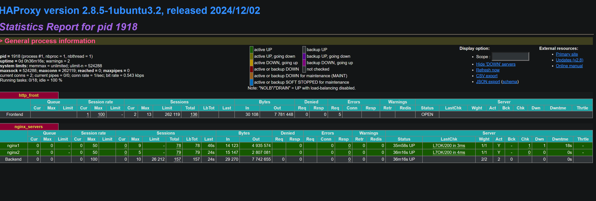

# High Availability Portfolio Project

---

## Overview

This project builds on my existing portfolio website by implementing:

- Google OAuth 2.0 login to restrict access to editing portfolio content
- GitHub Contributions widget to display public contribution history
- A highly available, load-balanced architecture using HAProxy and two Nginx servers as reverse proxies
- Deployed on cloud infrastructure with custom domain (leeanneli.space) pointing to HAProxy

---

## Technologies Used

- Node.js + Express.js (backend)
- Nginx (reverse proxy on two backend nodes)
- HAProxy (load balancer)
- Caddy (local testing) (optional)
- Google Cloud Console (OAuth credentials)
- GitHub Contributions Widget via CDN
- ApacheBench (ab) for load testing

---

## Deployment Architecture

```
            leeanneli.space (via DNS)
                      ↓
                  HAProxy (Public IP: 184.73.80.152)
                 /        \
         Nginx Server 1    Nginx Server 2
         (Proxy to         (Proxy to
          Express.js)       Express.js)
```

---

## OAuth Setup

Used Google Cloud Console to configure:

- Authorized JavaScript origins: https://leeanneli.space
- Authorized redirect URIs: https://leeanneli.space/auth/google/callback

Integrated via passport-google-oauth20 in Express.js.

1. **Create a new project on Google Cloud Console**  
   Visit: https://console.developers.google.com/  
   Click on “New Project”, give it a name (e.g., `portfolio-oauth`), and create it.

2. **Enable OAuth APIs**  
   Navigate to “APIs & Services” > “Library”  
   Search and enable:
   - Google+ API
   - People API (optional)

3. **Set up the OAuth consent screen**  
   - User type: External
   - App name, support email, and developer contact info: Fill these out
   - Scopes: Leave default for basic profile/email info
   - Add test users (your own Google account)

4. **Create credentials**  
   - Go to “Credentials” > “Create Credentials” > “OAuth client ID”
   - Application type: Web Application
   - Authorized JavaScript origins: `https://leeanneli.space`
   - Authorized redirect URIs: `https://leeanneli.space/auth/google/callback`
---

## High Availability Setup Steps
1. **Set up two Nginx servers**
   - Install Node.js, Nginx, and clone the same Express app
   - Nginx config should reverse proxy to `localhost:3000`:

```nginx
server {
    listen 80;

    location / {
        proxy_pass http://localhost:3000;
        proxy_http_version 1.1;
        proxy_set_header Upgrade $http_upgrade;
        proxy_set_header Connection 'upgrade';
        proxy_set_header Host $host;
        proxy_cache_bypass $http_upgrade;
    }
}
```

2. **Run the Express app**  
   Either using `node server.js` 

3. **Set up HAProxy server**  
   Install HAProxy:
```bash
sudo apt update
sudo apt install haproxy -y
```

Edit `/etc/haproxy/haproxy.cfg`:

```haproxy
frontend http_front
    bind *:80
    default_backend nginx_servers

backend nginx_servers
    balance roundrobin
    option httpchk GET /
    http-check send meth GET uri / ver HTTP/1.1 hdr Host 'yourdomainname'
    server nginx1 'ipaddress':80 check
    server nginx2 'ipaddress':80 check
```

## Explanation of HAProxy Configuration

- `frontend http_front`: Entry point for all traffic on port 80
- `bind *:80`: Listens on all IPs on port 80
- `default_backend nginx_servers`: Defines the backend pool for routing
- `balance roundrobin`: Distributes traffic evenly to each backend server in turn
- `option httpchk GET /`: Performs health checks by sending GET requests to the `/` path
- `http-check send meth GET uri / ver HTTP/1.1 hdr Host leeanneli.space`: Explicitly defines a valid HTTP request for health checks
- `server nginx1 'ipaddress':80 check`: Adds a backend server with health checking enabled

---

Replace the IPs with the private IPs of the Nginx servers.

4. **Restart HAProxy**  
```bash
sudo systemctl restart haproxy
sudo systemctl enable haproxy
```

5. **DNS Configuration**  
   Point your domain’s A record to the HAProxy **public IP** 

---
## Performance Results and Benefits of HAProxy Load Balancing

### Test Summary

Performance testing was conducted using ApacheBench (`ab`) with the following command:

```bash
ab -n 100 -c 10 http://leeanneli.space/
```
## HAProxy Dashboard

This screenshot shows both Nginx servers successfully receiving traffic:




**Results:**
- Total Requests: 100
- Concurrency Level: 10
- Requests per second: 614.75
- Time per request: 16.26 ms (mean)
- Failed requests: 0
- Transfer rate: 3.59 MB/s
- Longest request time: 35 ms

These results indicate that the system is performing extremely well under concurrent load. With a concurrency level of 10, the average response time per request remained under 20 milliseconds — a strong indicator of efficient backend processing and effective traffic routing.

The server sustained a high throughput of over **600 requests per second** without any failed requests. 

### Benefits of HAProxy in This Setup

- **Load Distribution:** HAProxy’s round-robin algorithm evenly distributes incoming requests to both Nginx reverse proxies. This prevents any single server from becoming a bottleneck.
  
- **Health Checks:** Built-in HTTP health checks ensure that traffic is only routed to servers that are alive and functioning. If one backend fails, traffic is automatically directed to the healthy server without downtime.

- **Scalability:** As traffic grows, more Nginx servers can be added to the backend pool with minimal configuration changes in HAProxy.

- **High Availability:** If one of the Nginx + Express.js servers goes down, HAProxy continues serving requests through the remaining live instance, maintaining service continuity.


## Common Troubleshooting

Problem: Google OAuth redirect URI mismatch  
Cause: Used http:// instead of https:// in redirect URIs in Google Cloud Console  
Fix: Always use https://leeanneli.space/auth/google/callback in both JS Origins and Redirect URIs.

---

Problem: HAProxy service wouldn't start  
Cause: Syntax error in /etc/haproxy/haproxy.cfg, such as deprecated option httpchk  
Fix: Use updated syntax:

```haproxy
option httpchk GET /
http-check send meth GET uri / ver HTTP/1.1 hdr Host leeanneli.space
```

Test before restarting:
```bash
sudo haproxy -c -f /etc/haproxy/haproxy.cfg
```

---

Problem: Website not loading after pushing changes to GitHub  
Cause: HAProxy or Express server not restarted  
Fix: SSH into the backend server and:

```bash
pm2 restart server.js  # or
node server.js
```

Then restart HAProxy if needed:
```bash
sudo systemctl restart haproxy
```

---

## Final Deliverables

- OAuth-secured portfolio with edit functionality
- GitHub contribution calendar embedded
- HAProxy load balancing across Nginx instances
- Performance tested using ApacheBench
- Live demo: http://leeanneli.space


---

